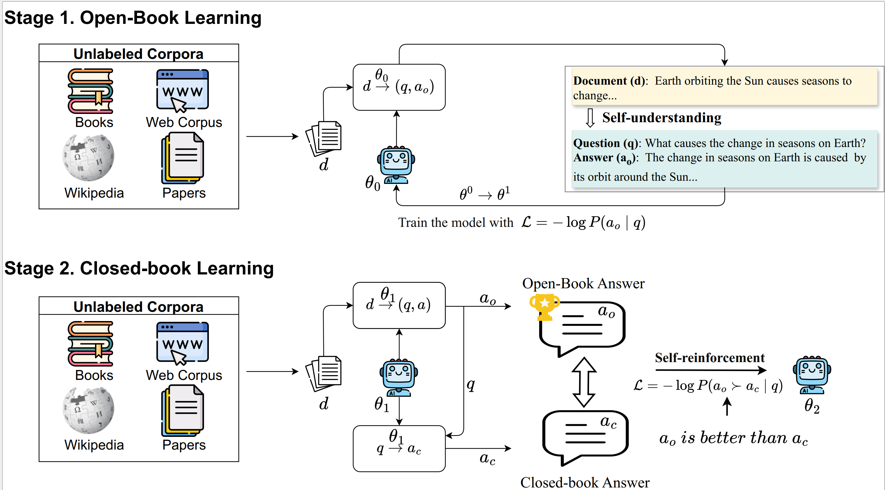

#
This is the official repository for the paper 'LLMs Could Autonomously Learn Without External Supervision'.


# Requirements

* Python == 3.10.13
* torch == 2.0.1
* transformers == 4.35.0
* alignment-handbook == 0.3.0.dev0
* numpy == 1.26.3
* vllm == 0.2.1
* trl == 0.7.4
* accelerate == 0.23.2

# Preprocess

## Split the data resource into multiple documents
```
python data_generator/data_book.py
```

## Filter documents greater than 512
```
python data_generator/filter.py
```

# Stage 1: Open-Book learning

## D->QA
```
accelerate launch models/vllm_predict.py
```

## Perform self-understanding
```
ACCELERATE_LOG_LEVEL=info accelerate launch --config_file recipes/accelerate_configs/deepspeed_zero3.yaml my_scripts/run_open_book.py recipes/run_MedQA_book_cn/sft/config_full_en.yaml
```

# Stage 2: Closed-Book learning
```
bash run_closed_book.sh
```
# Eval
```
accelerate launch eval/test_single_choice.py
```

# Reproducibility
We experiment on 8 Tesla A100-80GB.

# Citation
If you found this repository is helpful, please cite our paper:
```

```